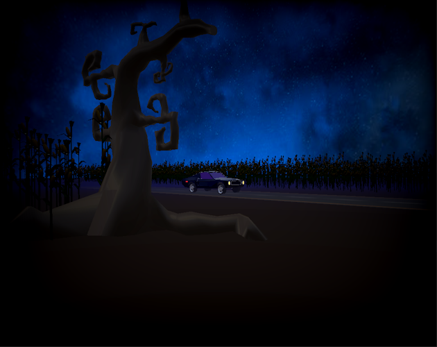

# Fright Night

Entry for LibGDX Gam Jam #26 (September 2023).

This is a 3D first person game where you wander around a road, corn fields, a church and a graveyard and are accosted by hell-hounds, zombies and a motor vehicle.
Despite having no weapons, your task is to be the sole survivor and ride off into the sunset. How to beat the game is for the player to figure out as a puzzle, although the game offers some hints.

The game features models created in Blender, including some animated ones, rendered using gdx-gtlf.  The web version makes use of the gdx-teavm extension.
The desktop version has support for controllers. Features 3d lightning effect. Rain particles. Decals for the cornfield. Some fancy shader effects on the intro and exit screen.  Voice narration with subtitles. 
Quick-save (F5) and reload (F9).

You can play it here: [itch.io](https://monstrous-software.itch.io/fright-night)

Watch review here: [youtube](https://www.youtube.com/watch?v=GzjYod9lmw4&t=5852s)

-----
A [libGDX](https://libgdx.com/) project generated with [gdx-liftoff](https://github.com/tommyettinger/gdx-liftoff).

This project was generated with a template including simple application launchers and a main class extending `Game` that sets the first screen.

## Platforms

- `core`: Main module with the application logic shared by all platforms.
- `lwjgl3`: Primary desktop platform using LWJGL3. Use this for controller support.
- `html`: Not tested. Probably broken.
- `teavm`: Experimental web platform using TeaVM and WebGL. This was used for the web version.

## Software

- libgdx 1.12.0
- gdx-gltf by MGSX
- gdx-teavm by Xpenatan
- gdx-controllers & gdx-controller-utils by Mr. Stahlfelge

## Assets

For credits see in-game credits screen.

